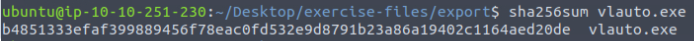

# FORENSICS CHALLENGE

## THM_TShark-Challenge-II

**Description**

An alert has been triggered: "A user came across a poor file index, and their curiosity led to problems".

The case was assigned to you. Inspect the provided directory-curiosity.pcap located in ~/Desktop/exercise-files and retrieve the artefacts to confirm that this alert is a true positive.

Your tools: TShark, VirusTotal.

Investigate the DNS queries.
Investigate the domains by using VirusTotal.
According to VirusTotal, there is a domain marked as malicious/suspicious.

**Walkthrough**

### Question 1
What is the name of the malicious/suspicious domain? Enter your answer in a defanged format.

### Answer

So lets navigate to the directory and have a look around
- cd ~/Desktop/exercise-files
- ls

Right so we can see the file we need to perform actions on is *directory-curiosity.pcap*

We have been instructed to investigate the DNS queries of the.pcap file. So we can use the command:
- tshark -r directory-curiosity.pcap -T fields -e dns.qry.name | awk NF | sort -r | uniq -c | sort -r

This command sequence extracts DNS query names from the given PCAP file, filters out any empty results, sorts the names in reverse order, counts how often each unique DNS query appears, and then sorts this list of DNS query names by frequency in descending order.

The result is a list of DNS query names sorted by how frequently they were queried in the captured traffic, with the most frequently queried names appearing at the top of the list.

So now we can open up VirusTotal and enter the names to see which one is linked to suspicious activity. By going through our list we quickly determine it is jx2-bavuong.com, which is linked to Malware. We just need to defang this domain using CyberChef to get the flag.

**Flag 1:** jx2-bavuong[.]com

### Question 2
What is the total number of HTTP requests sent to the malicious domain?

#### Answer 
So we need to extract all HTTP request packets from the PCAP file. Then we need to filter these requests to find those specifically directed at the domain jx2-bavuong.com. Finally, count the number of requests to this domain.
- tshark -r directory-curiosity.pcap -Y "http.request" -T fields -e http.host | grep 'jx2-bavuong.com' | wc -l

**Flag 2:** 14

### Question 3
What is the IP address associated with the malicious domain? Enter your answer in a defanged format.

#### Answer 
To find the IP address associated with the malicious domain jx2-bavuong.com, the following approach was used:

Initial Commands Attempted:
- Command 1: tshark -r directory-curiosity.pcap -Y "dns.qry.name == 'jx2-bavuong.com' && dns.a" -T fields -e dns.a
- Command 2: tshark -r directory-curiosity.pcap -Y "dns.qry.name == 'jx2-bavuong.com.' && dns.a" -T fields -e dns.a

These commands did not return any results, because:

1. Domain Name Format: The exact format of the domain name might have differed (e.g., with or without a trailing dot).
2. Response Filtering: These commands focused on filtering DNS queries, which may not have captured the DNS responses containing the A records.

So i decided to extract all DNS A records and their associated queries from the DNS responses. 
- tshark -r directory-curiosity.pcap -Y "dns.a" -T fields -e dns.qry.name -e dns.a

The IP address associated with the malicious domain jx2-bavuong.com was successfully identified by extracting DNS A records from the PCAP file, ensuring the results were properly formatted and correctly matched the domain of interest. To get the final flag we just need to defang the IP we found in the image above.

**Flag 3:** 141[.]164[.]41[.]174

### Question 4
What is the server info of the suspicious domain?

#### Answer 
We need to find the HTTP response headers for the suspicious domain. The server information is typically found in the Server header of HTTP responses, which provides details about the software and version used by the web server hosting the domain. 

1. First, filter out HTTP response packets that include the Server header.
2. Extract the Server header from the HTTP response packets to find the server information.

- tshark -r directory-curiosity.pcap -Y "http.response" -T fields -e http.host -e http.server

**Flag 4:** Apache/2.2.11 (Win32) DAV/2 mod_ssl/2.2.11 OpenSSL/0.9.8i PHP/5.2.9

### Question 5
Follow the "first TCP stream" in "ASCII". Investigate the output carefully.
What is the number of listed files?

#### Answer 

1. We need to locate the first TCP stream in the PCAP file
- tshark -r directory-curiosity.pcap -q -z tcp,streams

We get a long list of returned TCP Streams, we will assume the first stream represents the first TCP stream and follow it

2. Extract the data for the identified TCP stream and convert it to ASCII format for analysis
- tshark -r directory-curiosity.pcap -q -z follow,tcp,ascii,0

So we have followed the TCP stream number '0' and outputed it in ASCII format. We then need to read carefully and identify any file names and count the total to find the flag. I register 3 potential files (123.php, vlauto.exe, vlauto.php) that can be seen linked in the image.

**Flag 5:** 3

### Question 6
What is the filename of the first file? Enter your answer in a defanged format.

#### Answer 
By reading the ASCII output we got previously we can see '123.php'. We just need to defang to get the flag.

**Flag 6:** 123[.]php

### Question 7
Export all HTTP traffic objects. What is the name of the downloaded executable file? Enter your answer in a defanged format.

#### Answer 
So we need to extract and examine the HTTP objects (files) from the PCAP file. This will allow us to identify the specific file that was downloaded. 
- tshark -r directory-curiosity.pcap --export-objects http,export
- cd export/
- ls

The last object in the list is what we're looking for, defang to get the flag.

**Flag 7:** vlauto.exe

### Question 8
What is the SHA256 value of the malicious file?

#### Answer 
-sha256sum vlauto.exe

**Flag 8:** Seen in image

### Question 9
Search the SHA256 value of the file on VirtusTotal. What is the "PEiD packer" value?

#### Answer 
Simply paste the hash into VirusTotal and search. Go to Basic Properties to find the flag (seen in image)

**Flag 9:** Seen in image

### Question 10
Search the SHA256 value of the file on VirtusTotal. What does the "Lastline Sandbox" flag this as?

#### Answer
Staying on VirusTotal go to the Behaviour tab and scroll down to find the flag.

**Flag 10:** Seen in image